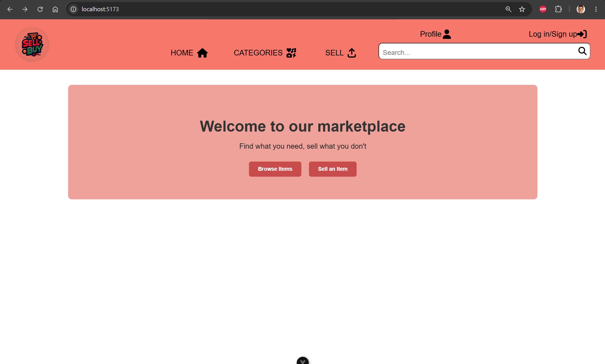
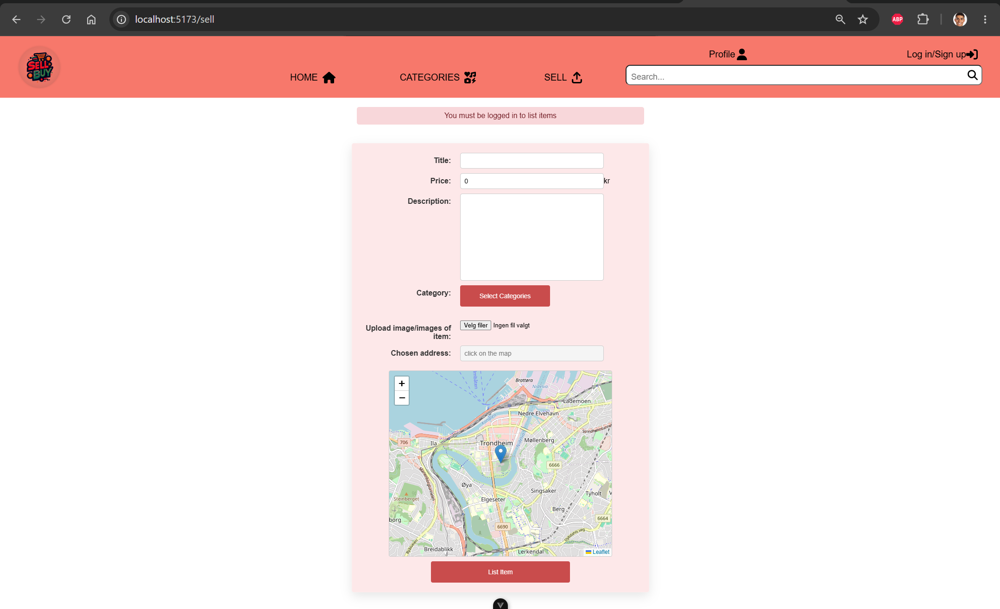
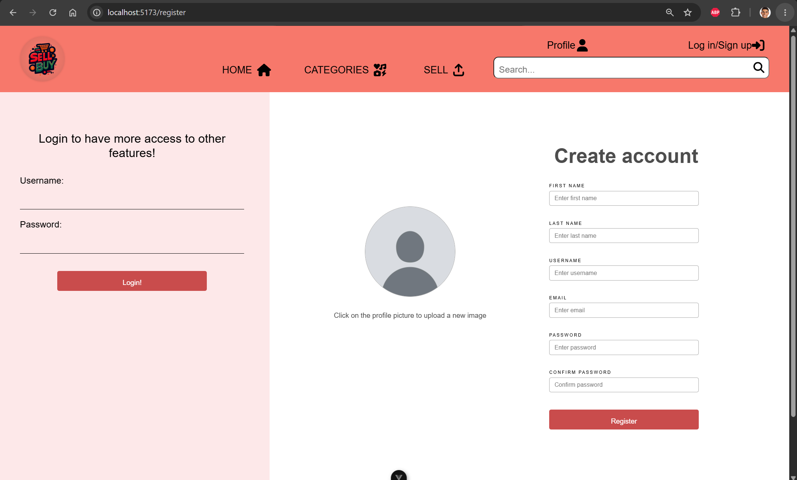
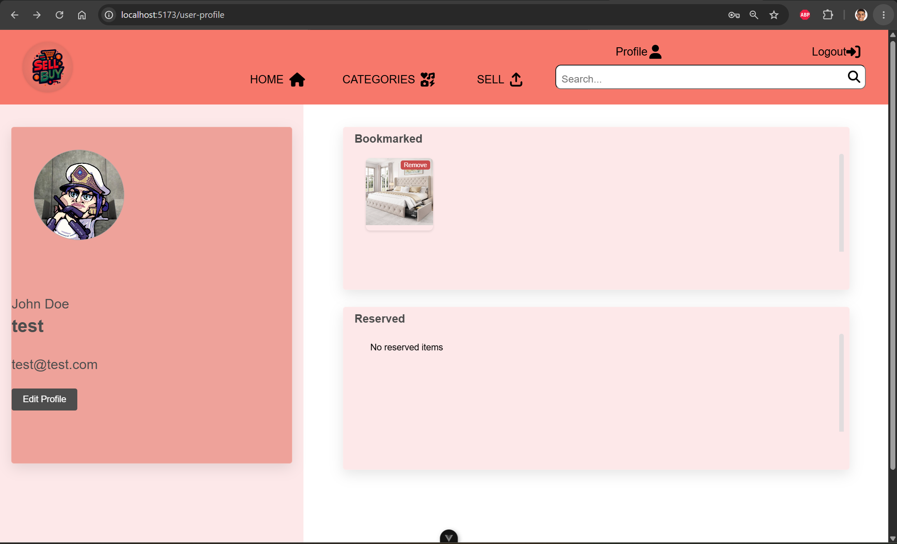

## 1. Project title
Marketplace Full-Stack Project

## 2. Overview
This repository contains a full-stack marketplace application. Users can register and log in, browse and search listings, view item details with images and location data, create and update listings, and manage bookmarks and reservations.

## 3. Context
This project was developed as part of **IDATT2105 Full-stack Application Development** at **NTNU**.  
It is a university project intended for learning and portfolio presentation.

## 4. Features
- User registration and login with JWT-based authentication
- Item browsing and filtering/search flows
- Item detail pages with image handling
- Location display using reverse geocoding
- Listing creation and update
- Bookmark and reservation management
- API documentation with Swagger UI

## Screenshots
Representative UI views from the current project implementation:






## 5. Tech stack
**Frontend**
- Vue 3
- Vite
- Vue Router
- Pinia
- Axios
- Leaflet
- FontAwesome
- Vitest
- ESLint

**Backend**
- Java 21
- Spring Boot 3.4.4
- Spring Web
- Spring Data JPA
- Spring Security with JWT (JJWT)
- H2 / MySQL
- SpringDoc OpenAPI
- JUnit 5
- JaCoCo

## 6. Project structure
```text
idatt2105-full-stack-project/
  backend/    Spring Boot API and data layer
  frontend/   Vue client application
  docs/       Project documentation (including security review)
```

## 7. How to run
**Frontend**
```bash
cd frontend
npm install
npm run dev
```

**Backend**
```bash
cd backend
./mvnw spring-boot:run
```

Backend base URL: `http://localhost:8888`

## 8. Testing and build commands
**Frontend**
```bash
cd frontend
npm run build
npm run test:unit
npm run lint
```

**Backend**
```bash
cd backend
mvn test
mvn verify
```

## 9. API documentation
Swagger UI is available when the backend is running:

- [http://localhost:8888/swagger-ui.html](http://localhost:8888/swagger-ui.html)

## 10. Security note
This repository is a university full-stack demo project and is not intended as a production system.  
See [docs/security-review.md](docs/security-review.md) for a concise security and privacy review.

## 11. Status
This is an academic portfolio project and is not production-ready.  
Current functionality reflects coursework scope, with clear opportunities for further hardening and polish.
